# Eco-Volunteer-Research-Collaboration-Portal

[GitHub Repository](https://github.com/Telesphore-Uwabera/EcoRwanda-Conservation-Portal/)

This project is an Eco-Volunteer and Research Collaboration Portal, designed to facilitate collaboration between volunteers, researchers, and park rangers in ecological conservation efforts. It provides a centralized platform for managing users, tracking activities, and accessing relevant data.

## Project Structure

- `backend/`: Contains the Node.js Express server, API endpoints, and database models.
- `frontend/`: Contains the React application for the user interface.

## Features

- **User Authentication:** Secure login and registration for various roles (Administrator, Volunteer, Researcher, Ranger).
- **Role-Based Access Control:** Different dashboards and functionalities based on user roles.
- **Admin Dashboard:** Overview of system statistics, user management, and user registration by admin.
- **Volunteer Dashboard:** Personalized greetings and data relevant to volunteers.
- **Researcher Dashboard:** Personalized greetings and data relevant to researchers.
- **Ranger Dashboard:** Personalized greetings and data relevant to rangers.
- **User Management (Admin):** Ability to view, update roles, and delete user accounts.
- **API Integration:** Secure communication between frontend and backend.

## Screenshots

### Authentication & Registration
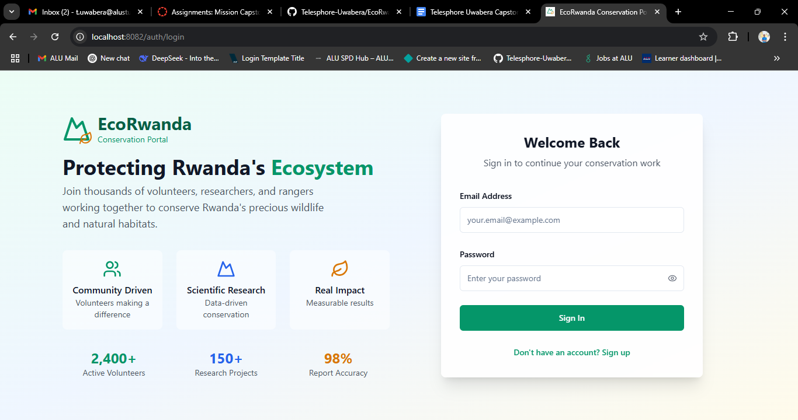
*Login page with fields for user credentials and role-based authentication.*

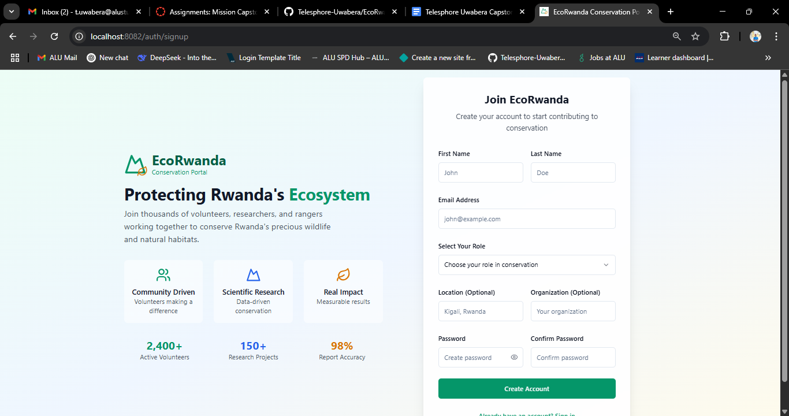
*User registration form for volunteers and researchers, allowing new users to sign up.*

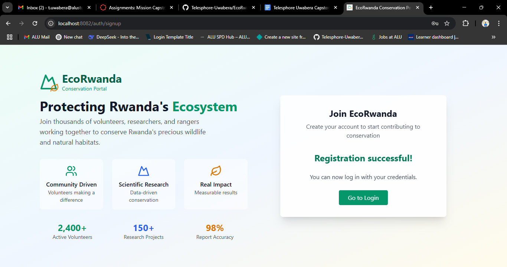
*Confirmation or success page shown after successful registration.*

### Dashboards
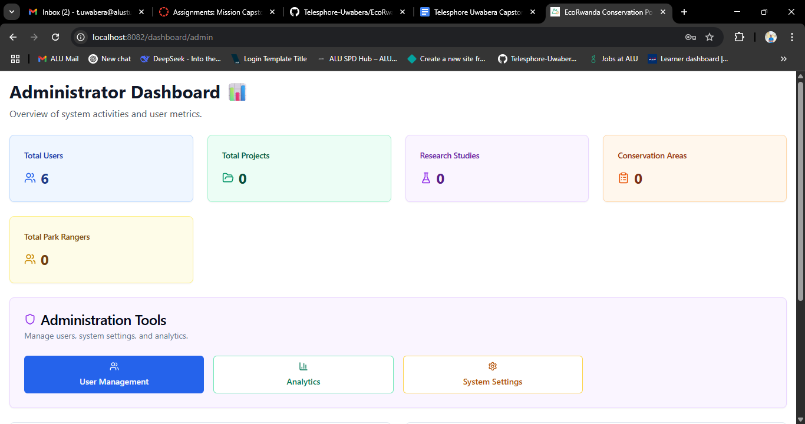
*Administrator dashboard showing system overview, statistics, and management tools.*

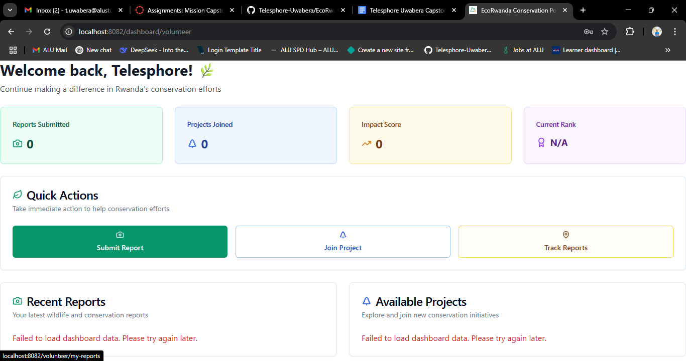
*Volunteer dashboard with personalized activities, tasks, and project updates.*


*Researcher dashboard displaying research projects, data, and collaboration tools.*

### User Management & Admin
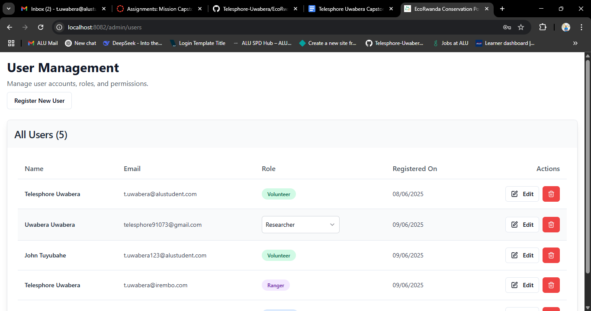
*Admin interface for managing user accounts, roles, and permissions.*

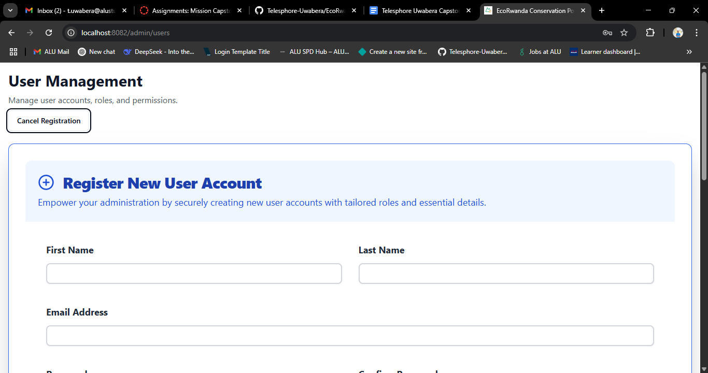
*Admin registration or creation form, used for adding new administrators.*

### Volunteer Features

*General volunteer interface, showing volunteer profile or main menu.*

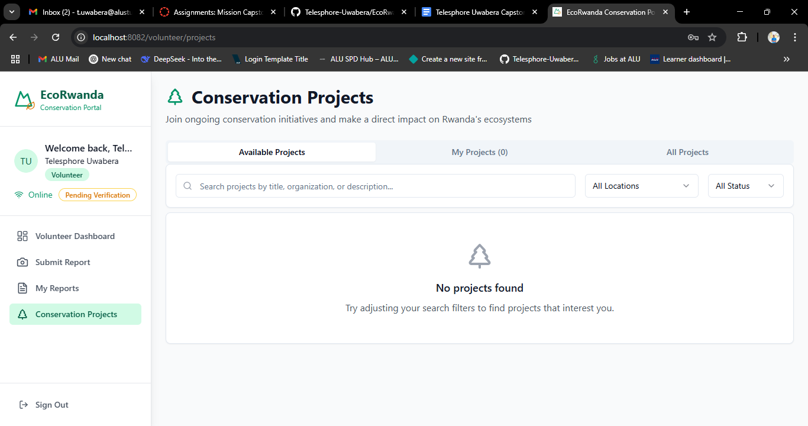
*List or overview of projects available to volunteers.*

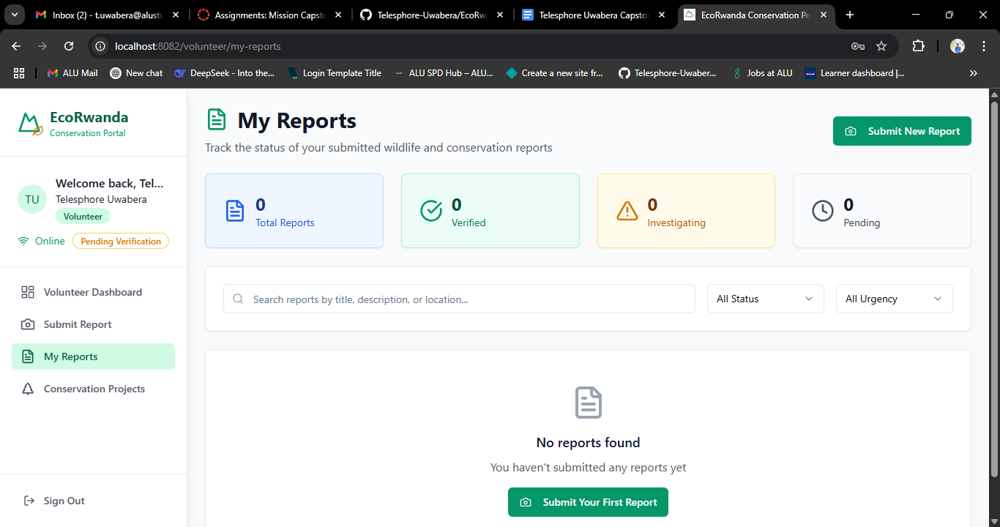
*Section where volunteers can view or manage their submitted reports.*

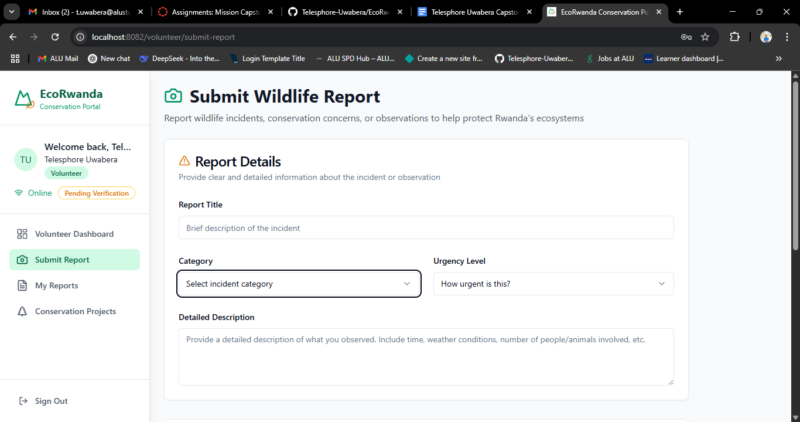
*Form or page for volunteers to submit new reports.*

### Researcher Features
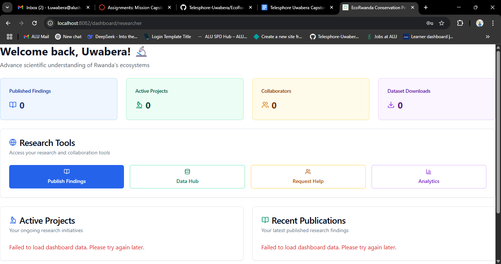
*General researcher interface, showing researcher profile or main menu.*

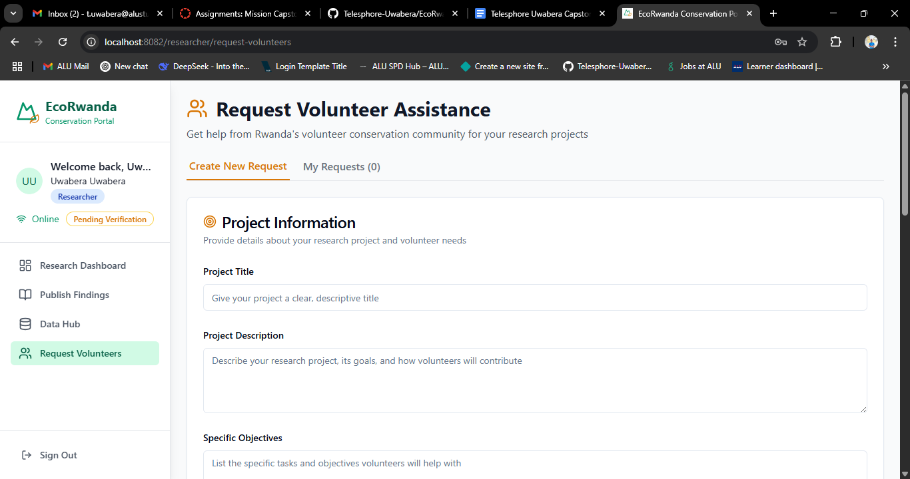
*Page for researchers to view or manage their requests (e.g., data, collaboration).*

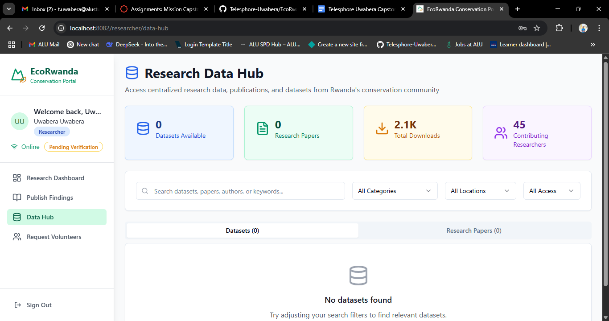
*Central hub for researchers to access and manage research data.*

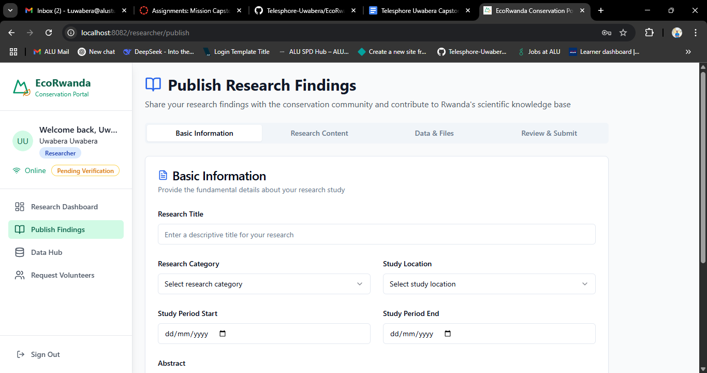
*Interface for researchers to publish new findings or reports.*

### Other Screenshots
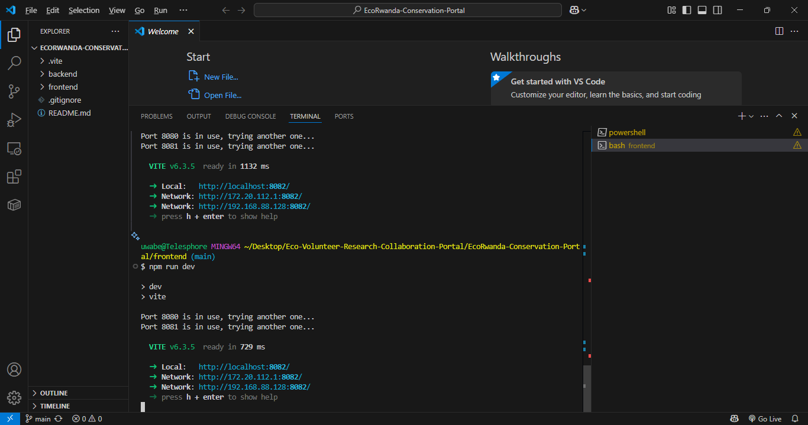
*Overview of the frontend application, the landing or home page.*

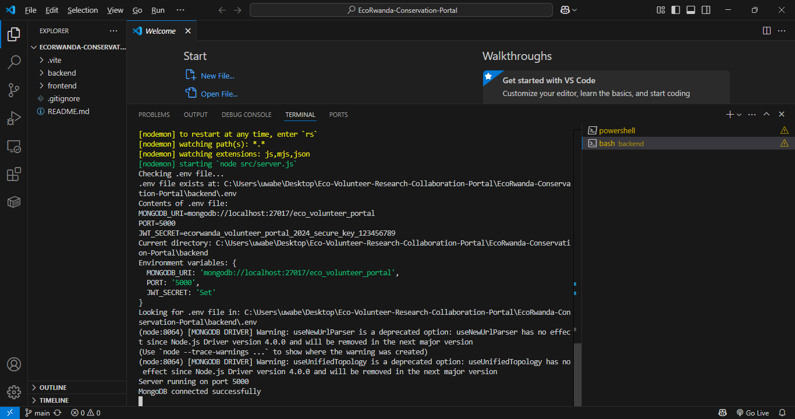
*Overview of the backend admin panel or API dashboard.*

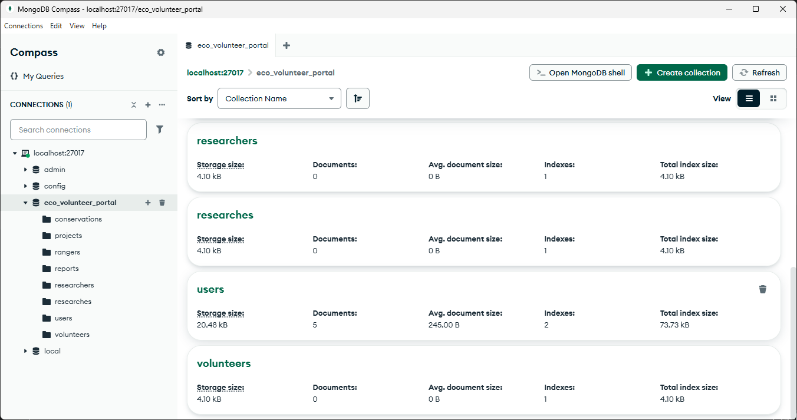
*Screenshot of the MongoDB database interface, showing collections or data.*

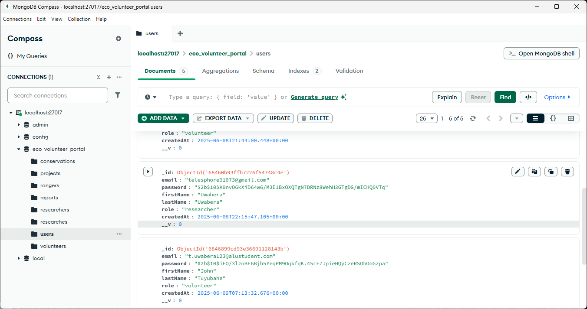
*Another view of the MongoDB database, a different collection or data set.*

## Technologies Used

### Frontend
- **React:** A JavaScript library for building user interfaces.
- **Vite:** A fast frontend build tool.
- **TypeScript:** A superset of JavaScript that adds static typing.
- **Tailwind CSS:** A utility-first CSS framework for rapid UI development.
- **Material-UI (MUI):** A comprehensive suite of UI tools for React.
- **React Router DOM:** For declarative routing in React applications.
- **Axios:** For making HTTP requests.

### Backend
- **Node.js:** A JavaScript runtime.
- **Express.js:** A fast, unopinionated, minimalist web framework for Node.js.
- **MongoDB:** A NoSQL database.
- **Mongoose:** An ODM (Object Data Modeling) library for MongoDB and Node.js.
- **bcryptjs:** For hashing passwords.
- **jsonwebtoken:** For implementing JSON Web Tokens for authentication.
- **dotenv:** For loading environment variables from a `.env` file.
- **Nodemon:** A tool that helps develop Node.js based applications by automatically restarting the node application when file changes in the directory are detected.

## Getting Started

Follow these instructions to set up and run the project on your local machine.

### Prerequisites

- Node.js (v14 or higher recommended)
- npm (Node Package Manager)
- **MongoDB Atlas Account:** (For cloud-hosted database. A free M0 Sandbox tier is sufficient for development.)
- MongoDB Compass (Optional, for database inspection and initial admin setup)

### 1. Backend Setup

Navigate to the `backend` directory, install dependencies, and start the server.

```bash
# Navigate to the backend directory
cd backend

# Install backend dependencies
npm install

# Create a .env file in the backend directory with your MongoDB Atlas URI and PORT
# Example .env content:
# MONGODB_URI=mongodb+srv://<username>:<password>@yourcluster.mongodb.net/eco_volunteer_portal?retryWrites=true&w=majority
# PORT=5000
# JWT_SECRET=your_strong_jwt_secret_key (important for authentication)

# Start the backend server (development mode with nodemon)
npm run dev
```
The backend server should now be running on `http://localhost:5000`.

### 2. Frontend Setup

In a new terminal, navigate to the `frontend` directory, install dependencies, and start the development server.

```bash
# Navigate to the frontend directory 
cd frontend

# Install frontend dependencies
npm install

# Start the frontend development server
npm run dev
```
The frontend application should now be accessible at `http://localhost:3000` (or another port if configured differently by Vite).

**Important Note on API Configuration:**
Ensure that `frontend/src/config/api.ts` has `API_BASE_URL` set to `/api`. This allows the Vite development server to proxy API requests to the backend, preventing `ERR_CONNECTION_REFUSED` errors.
```typescript
// frontend/src/config/api.ts
const API_BASE_URL = '/api';
```

### 3. Database Connection and Initial Administrator Setup (MongoDB Atlas)

The backend connects to MongoDB Atlas using the `MONGODB_URI` specified in your `backend/.env` file. Ensure you have configured a user and allowed network access in your MongoDB Atlas project. The default database name used in the backend is `eco_volunteer_portal`.

**Creating the Initial Administrator (Superuser) via MongoDB Compass or Atlas UI:**

The public registration portal is designed for 'volunteer' and 'researcher' roles. To create the first 'administrator' account, you need to insert it directly into your MongoDB Atlas database.

1.  **Generate a Hashed Password:**
    Open a terminal, navigate to the `backend` directory, and run the following command to generate a bcrypt hash for your desired administrator password:
    ```bash
    cd backend
    node -e "require('bcryptjs').hash('strong_password', 10).then(hash => console.log(hash));"
    ```
    Replace `'strong_password'` with the actual password. Copy the output (the long hash string).

2.  **Insert Administrator Document via MongoDB Compass or Atlas UI:**
    *   Open MongoDB Compass and connect to your MongoDB Atlas cluster using the URI (e.g., `mongodb+srv://<username>:<password>@yourcluster.mongodb.net/`).
    *   Navigate to the `eco_volunteer_portal` database (or your chosen database name).
    *   Select or create the `users` collection.
    *   Click "ADD DATA" -> "Insert Document".
    *   Switch to "JSON View" (the `{}` icon) and paste the following JSON, replacing `GENERATED_HASH_HERE` with the **hashed password** you just generated:
        ```json
        {
          "firstName": "Admin",
          "lastName": "User",
          "email": "admin@ecorwanda.org",
          "password": "GENERATED_HASH_HERE",
          "role": "administrator",
          "organization": "Admin Org",
          "location": "Admin Location",
          "verified": true,
          "createdAt": { "$date": "ISO_DATE_STRING" }
        }
        ```
        Ensure the `createdAt` field uses `{"$date": "ISO_DATE_STRING"}` format for proper BSON date type (e.g., `"2025-06-10T00:00:00.000Z"`).
    *   Click "INSERT".

### 4. Registering Volunteers and Researchers via Portal

Once your backend is running and connected, you can register new 'volunteer' and 'researcher' accounts directly through the frontend's signup page (`http://localhost:3000/auth/signup`).

### 5. Login through the Portal

All users (administrators, researchers, volunteers, and park rangers if created by an admin) can log in through the main login portal at `http://localhost:3000/auth/login` using their registered email and password.

---
**Note on Password Hashing:** If you encounter "Invalid email or password" errors after manually inserting users, it's often due to discrepancies in bcrypt hashing. The recommended approach for an initial admin is direct DB insertion via the methods above, and for other roles (and subsequent admins), use the application's own registration/admin tools to ensure correct hashing.

**Troubleshooting `&&` in PowerShell:**
If you're using PowerShell and encounter errors with commands like `cd backend && npm start`, you need to run them separately:
```powershell
cd backend
npm start
```

### Backend Environment Variables (`backend/.env`)

Create a `.env` file in the `backend` directory with the following variables:

```
MONGODB_URI=mongodb+srv://<username>:<password>@yourcluster.mongodb.net/eco_volunteer_portal?retryWrites=true&w=majority
PORT=5000
JWT_SECRET=your_strong_jwt_secret_key

# Email Configuration for Password Reset (Example for Gmail)
# If using Gmail, you might need an App Password if 2FA is enabled.
# Generate one here: https://myaccount.google.com/apppasswords
EMAIL_HOST=smtp.gmail.com
EMAIL_PORT=587 # or 465 for SSL
EMAIL_USER=email@gmail.com
EMAIL_PASS=gmail_app_password
```

**Note:** Replace `<username>`, `<password>`, `yourcluster.mongodb.net`, `eco_volunteer_portal`, `your_strong_jwt_secret_key`, `email@gmail.com`, and `gmail_app_password` with actual secure values. For `JWT_SECRET`, ensure it's a strong, random string.

### Frontend Configuration (`frontend/src/config/api.ts`)

Ensure `API_BASE_URL` is set correctly to `/api` to utilize the Vite proxy for development.

```typescript
// frontend/src/config/api.ts
export const API_BASE_URL = '/api'; // This uses Vite's proxy in development
```

### Troubleshooting

*   **`&&` operator in PowerShell:** If you are using PowerShell on Windows and encounter errors when trying to run `cd backend && npm start`, you may need to run the commands separately:
    ```bash
    cd backend
    npm start
    ```

*   **`npm ERR! code ENOENT`:** This means `npm` can't find a `package.json` file. Ensure you are in the correct directory (`backend` or `frontend`) before running `npm install` or `npm start`/`npm run dev`.
*   **`querySrv ENOTFOUND` error:** This usually means your machine cannot resolve the MongoDB Atlas cluster's hostname. Ensure:
    *   Your MongoDB Atlas Network Access is configured to allow your current IP address (or temporarily, "Allow Access from Anywhere" 0.0.0.0/0).
    *   Your local DNS settings are working correctly (e.g., try flushing your DNS cache `ipconfig /flushdns` or setting public DNS servers like Google DNS 8.8.8.8/8.8.4.4).
*   **Database connection string:** Double-check that your `MONGODB_URI` in `backend/.env` exactly matches the connection string provided by MongoDB Atlas, including the correct username, password, cluster name, and database name.
``` 
